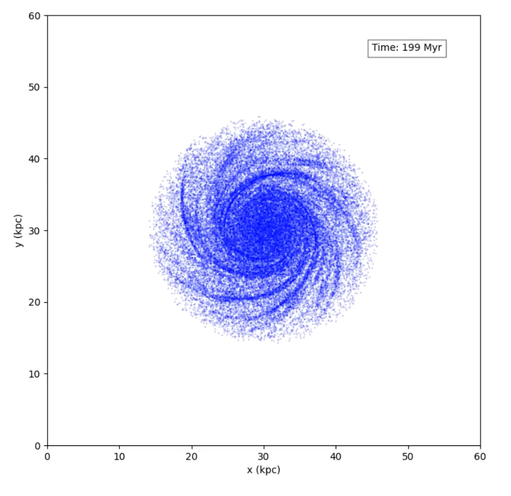

# ParticleSimulation
Implementation of the [particle-mesh](https://www.cs.cmu.edu/afs/cs/academic/class/15850c-s96/www/nbody.html#pm) and [particle-particle particle-mesh](https://www.cs.cmu.edu/afs/cs/academic/class/15850c-s96/www/nbody.html#p3m) methods.

Relies on a precompiled [FFTW](https://www.fftw.org/) 3.3.5 Windows DLL (64-bit version bundled with the project).
For other platforms [kissfft](https://github.com/mborgerding/kissfft) can be used.

## Build
```bash
mkdir build; cd build
cmake ..
cmake --build . --config Release
```

## Test
```bash
cd build
ctest
```

## Running a demo simulation
```bash
./run_simulation.ps1 <sim-name>
```

## Recreating the results in the thesis
```bash
./create_plots.ps1
```

### Running CUDA implementation of the PM method
Set `USE_CUDA` option to `ON` during configuration.

## Results
### Spiral galaxy simulation

