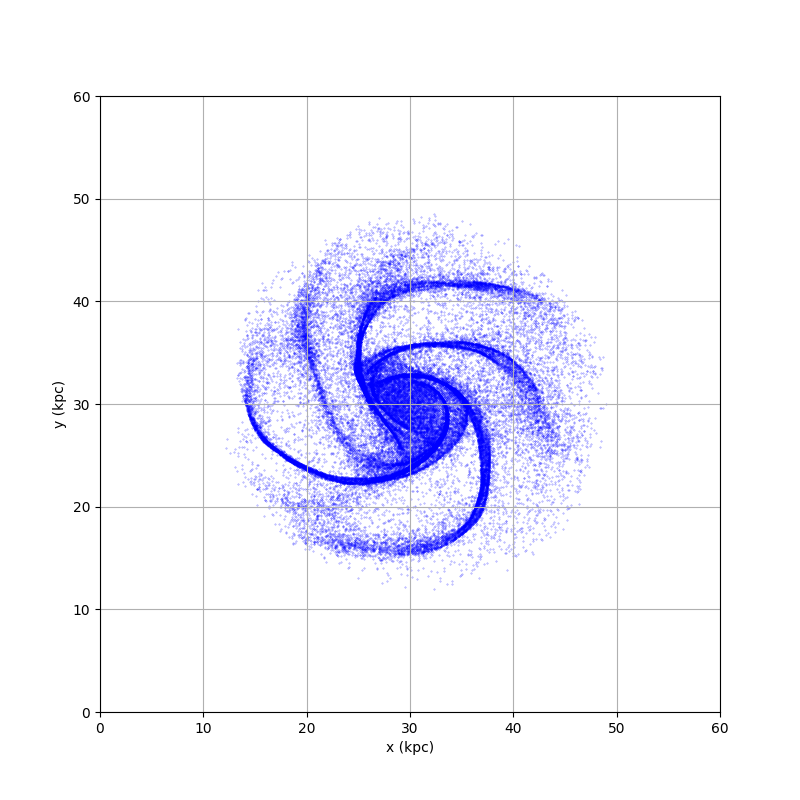
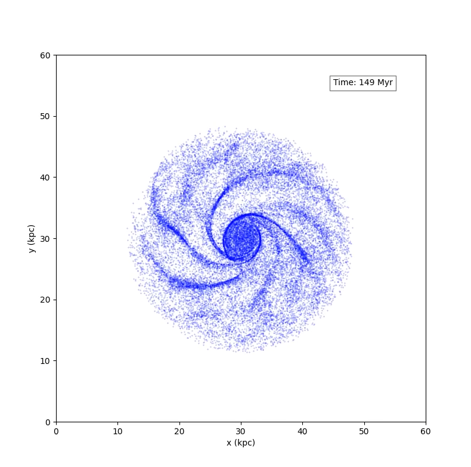

# ParticleSimulation
Implementation of the [particle-mesh](https://www.cs.cmu.edu/afs/cs/academic/class/15850c-s96/www/nbody.html#pm) and [particle-particle particle-mesh](https://www.cs.cmu.edu/afs/cs/academic/class/15850c-s96/www/nbody.html#p3m) methods.

Relies on a precompiled [FFTW](https://www.fftw.org/) 3.3.5 Windows DLL (64-bit version bundled with the project).
For other platforms [kissfft](https://github.com/mborgerding/kissfft) can be used.

## Build
```bash
mkdir build; cd build
cmake ..
cmake --build .
```

## Test
```bash
ctest
```

## Output viewing
### 3D
```bash
python script/animate.py <output file path>
```
For example (MSVC in Debug mode):
```bash
python script/animate.py build/source/Debug/output.txt
```
### 2D
```bash
python script/animate2d.py <output file path>
```
For example (MSVC in Debug mode):
```bash
python script/animate2d.py build/source/Debug/output.txt
```

### Final positions
```bash
python script/show_last.py <output file path>
```
For example (MSVC in Debug mode):
```bash
python script/show_last.py build/source/Debug/output.txt
```

## Total energy & momentum plots
```bash
python script/conserved_quantities.py <energy file path> <angular momentum file path> <momentum file path> <expected momentum file path>
```
For example (MSVC in Debug mode):
```bash
python script/conserved_quantities.py build/source/Debug/energy.txt build/source/Debug/angular_momentum.txt build/source/Debug/momentum.txt ./build/source/Debug/expected_momentum.txt
```
## Results
### Spiral galaxy simulation
#### PM method (CIC assignment, 50k particles)


#### P3M method (TSC assignment, 30k particles)

